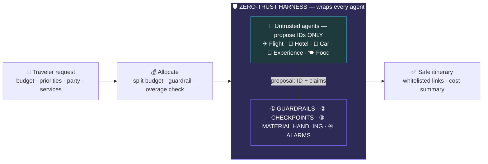
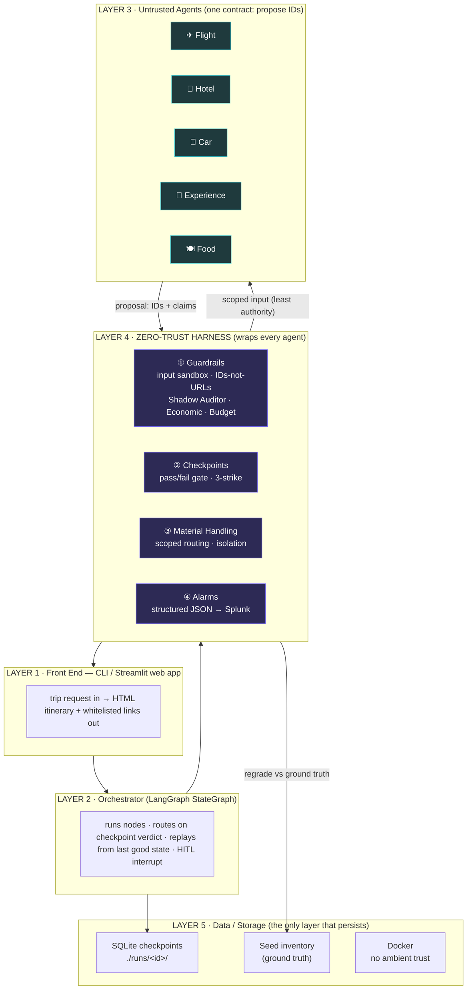
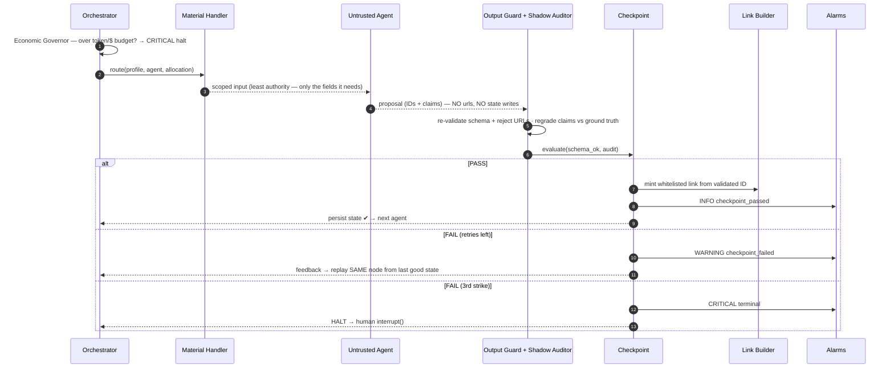
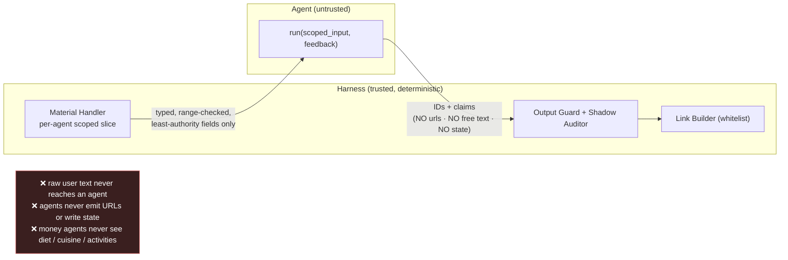
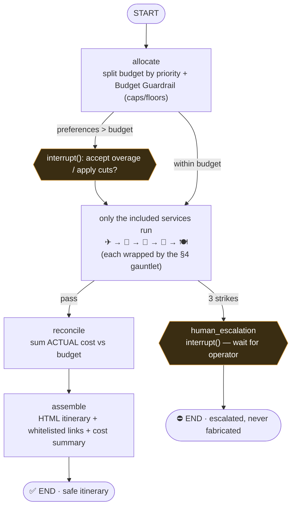

# GitTrippin — Architecture (HLD)

*A zero-trust framework that an untrusted AI agent lives inside. Travel is the demo; the **harness** is the product.*

---

## 1 · The real-world problem

Agentic systems are useful **because they take action** — they book, they link, they spend real money.
That is also exactly why they are dangerous. An LLM agent will, on a bad day:

| It will… | …and the user pays for it |
|---|---|
| **Hallucinate** a hotel/flight that doesn't exist | a booking to nowhere |
| **Inflate claims** — "4.8★" on a 2.5★ dump | a bad, unsafe stay |
| **Emit a phishing link** (`http://evil.tld/login`) | stolen credentials |
| **Leak data** between tasks (diet/medical prefs → billing) | privacy breach |
| **Overspend** in a retry/fallback loop | runaway cost |
| **Fabricate** a result rather than admit failure | silent, undetectable error |

You cannot fix this by asking the model to "be careful." **The agent's word can never be the
final word.** Authority has to live *outside* the model.

---

## 2 · The idea — wrap the agent in a harness

We treat **every agent as untrusted and replaceable**. All authority — input validation, link
minting, state, telemetry — is moved **out of the agent and into a deterministic harness** that
surrounds it. The agent's only job is to **propose an ID**. The harness independently re-grades
that proposal against data the agent does not control, builds the link itself, persists the state,
and raises an alarm on every violation.



> **The picture that *is* the pitch:** the harness **encloses** the agent — it is not a step after it.

---

## 3 · System architecture — five layers

Nothing crosses a layer boundary unvalidated. Layer 4 (the harness) sits in the gap between an
agent's *proposal* and a *booking*.



**Technology — and what each piece earns us:**

| Layer | Built with | Why |
|---|---|---|
| Orchestration | **LangGraph** `StateGraph` | state machine + **checkpointing + replay + `interrupt()`** for free |
| Trust boundary | **Pydantic** strict models | the contract is *declared in types* — injection can't become an instruction |
| Workers | **Python** agents (template / **Claude** swap-in) | one `Protocol`; provider-agnostic |
| Telemetry | **structured JSON → Splunk** (HEC) | live security observability |
| Runtime | **Docker** (non-root, `--network none`) | proves zero ambient trust — the demo needs no egress |

---

## 4 · How the agents work, and how they communicate

Agents never talk to each other and never touch shared state. **All communication flows through the
harness**, which mediates every hop. One agent's wrapped node runs this fixed gauntlet — identical
for all five, so an agent gains no authority by being "smarter":



**The two communication rules that make it zero-trust:**



- **Inbound:** raw text → strict `TripProfile` at the front door; each agent receives only a typed,
  scoped slice (the Flight agent literally never sees `diet`). A prompt-injection string in a
  closed-enum field *is not a valid value* — it can't become an instruction.
- **Outbound:** agents emit **opaque IDs + `claimed_*` numbers** only. The `NoUrlModel` validator
  rejects any URL. The **Shadow Auditor** then looks the ID up in ground-truth inventory and
  compares claim vs reality — catching hallucinated IDs, inflated ratings, and threshold violations.

---

## 5 · How the final outcome is produced

One budget in → one safe itinerary out. The orchestrator runs only the agents the trip needs,
retries the recoverable, escalates the unrecoverable, and reconciles real cost before assembling.



- **Optional agents** — `services` selects who runs (drive your own car → no flight/car; they get $0
  and never execute).
- **Budget Guardrail** — caps (hotel ≤ 65%) + floors keep one preference from starving the rest; if
  preferences exceed budget, the run **pauses *before booking*** and asks accept-overage or apply-cuts.
- **Checkpoints + replay** — state persists *only on PASS*, so a failed node replays from the last
  good checkpoint (upstream work is never recomputed); 3 failures → **human-in-the-loop**, never a
  fabricated booking.
- **Reconcile** — the harness sums the *validated* costs against budget; a residual overrun is a
  WARNING, never a hidden charge.

---

## 6 · Why it's different (the one-line takeaways)

- 🔒 **Zero-trust by construction** — raw user text never reaches an agent; agents never emit URLs or write state.
- 🔁 **Catches & recovers, never fabricates** — bad bookings are rejected and retried; the unrecoverable escalates to a human.
- 🔌 **Provider-agnostic** — swap any agent (template → Claude) and **not one line of the harness changes**. *Travel is just the demo.*

```
5 layers · 5 agents · 4 pillars · 38 passing control tests · 100% offline & deterministic
Stack: Python · LangGraph (state · checkpoint · replay · interrupt) · Pydantic · Docker · Splunk
```
