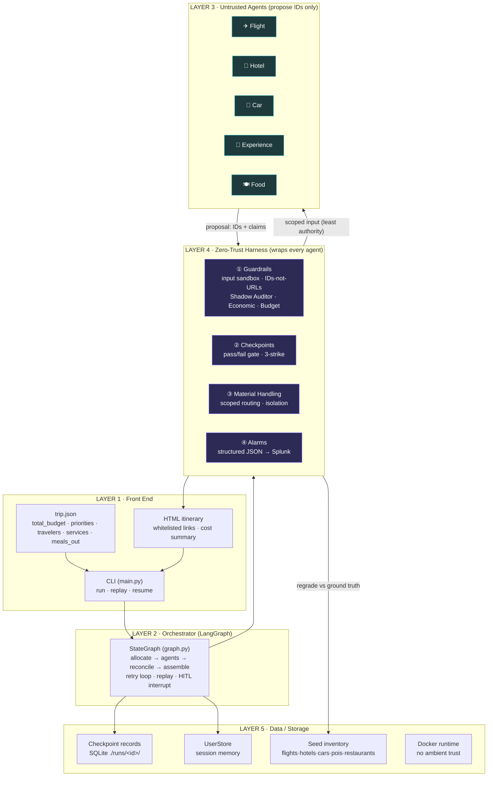
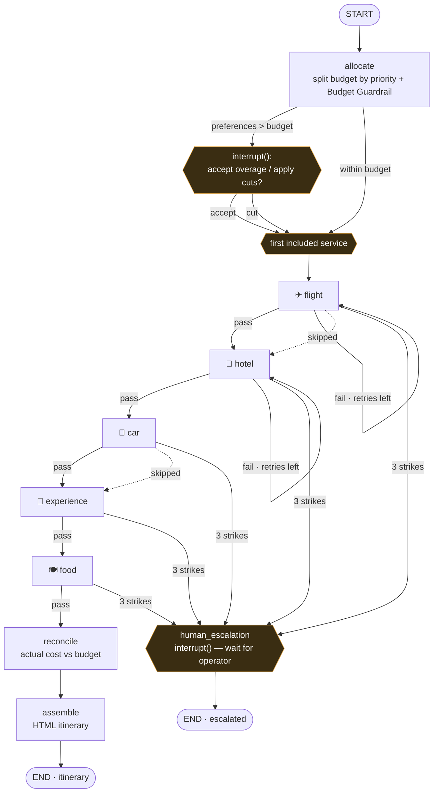
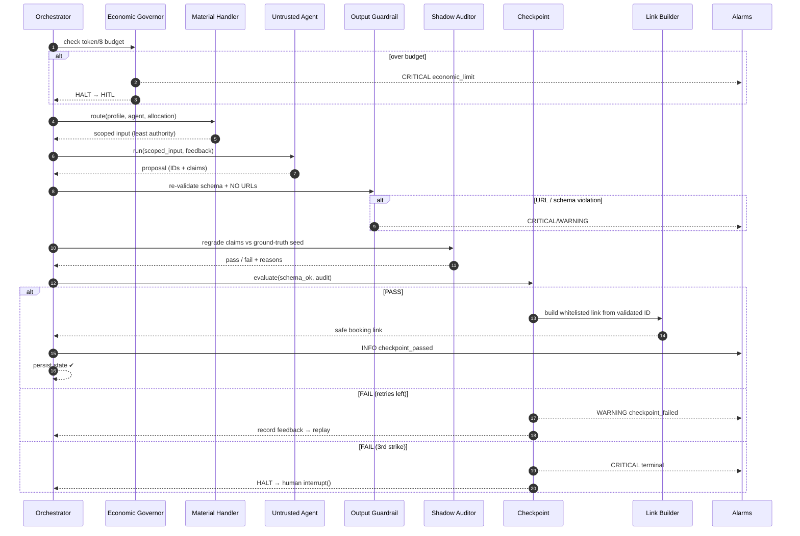
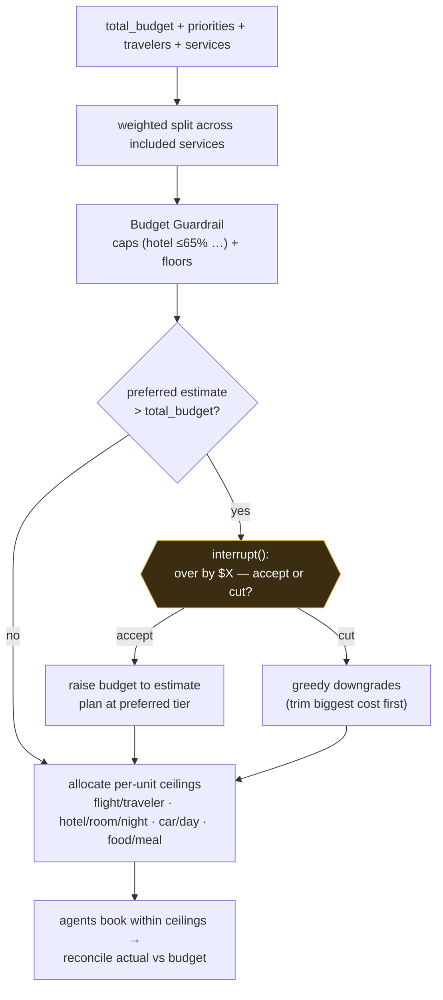
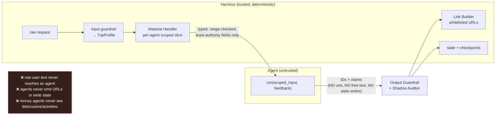

# GitTrippin — Diagrams

All diagrams are [Mermaid](https://mermaid.js.org/) — they render on GitHub, in VS Code (Markdown
preview), and paste into most slide tools. Edit them as text; no image files to maintain.

> **The one idea every diagram reinforces:** the four pillars live *outside* every agent. Agents
> propose IDs; the harness validates, builds links, persists state, and raises alarms. The agent's
> word is never trusted.

---

## 1. System architecture — the five layers

---

## 2. LangGraph state flow — pipeline, retries, skips, escalation

*Dotted edges = the agent is not in `services` (skipped). A failed checkpoint replays the **same**
node from the last good state with the rejection reason as feedback; the 3rd failure escalates.*

---

## 3. The per-node harness "gauntlet" — what wraps one untrusted agent

---

## 4. Budget allocation + the pre-booking overage decision

---

## 5. Trust boundary — what crosses, what never does

