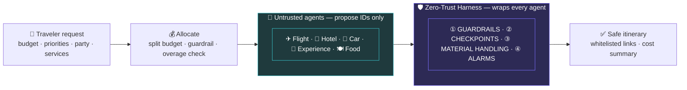

# GitTrippin — One-Page Infographic

> Use this as the poster / README hero / title slide. The Mermaid block is the "hero" visual;
> the **Design spec** at the bottom is what you hand to a designer (or paste into Figma/Canva) to
> turn it into a polished graphic.

---

## 🛡 GitTrippin
### A zero-trust control layer that governs untrusted LLM agents

**The agents are the product. The harness is what's defended.**
Agents only *propose IDs* — the harness validates every claim, builds the links, persists state, and raises alarms.

---

### The flow (hero diagram)



---

### The 4 pillars (declared, not implicit)

| ① Guardrails | ② Checkpoints | ③ Material Handling | ④ Alarms |
|---|---|---|---|
| Input sandbox (Pydantic) · IDs-not-URLs · **Shadow Auditor** regrades every claim · Economic + **Budget** guardrails | Explicit pass/fail after **every** node · replay from last good state · **3-strike → human** | Per-agent scoped slices · money agents never see diet/cuisine · least authority | Structured JSON (`type·severity·context·action`) · **Splunk-ready** live telemetry |

---

### Why it's different

- 🔒 **Zero-trust by construction** — raw user text never reaches an agent; agents never emit URLs or write state.
- 🔁 **Catches & recovers, never fabricates** — bad bookings are rejected and retried; the unrecoverable escalates to a human.
- 🔌 **Provider-agnostic** — swap any agent (template → Claude), the harness never changes. *Travel is just the demo.*

---

### By the numbers

```
5 layers   ·   5 agents   ·   4 pillars   ·   27 passing tests   ·   100% offline & deterministic
Stack: Python · LangGraph (state · checkpoint · replay · interrupt) · Pydantic · Docker · Splunk
```

---
---

## Design spec (hand-off for a polished graphic)

**Format:** single page / 16:9 title slide / poster. Portrait works for a printed one-pager; 16:9 for slides.

**Layout (top → bottom):**
1. **Header band** — shield icon + "GitTrippin" (bold), subtitle below. Tagline in italic.
2. **Hero flow strip** (horizontal): `Request → Allocate → [Agents box] → [Harness box] → Safe Itinerary`.
   Make the **Harness box visually enclose/underlap the Agents box** to convey "wraps every agent."
3. **Four pillar cards** — equal-width, icon + title + 1-line each.
4. **"Why it's different"** — three short bullets with icons.
5. **Footer stat band** — the by-the-numbers line + tech stack.

**Color palette (dark theme, matches the architecture PDF):**
| Role | Hex | Use |
|---|---|---|
| Background | `#0e0e1a` | page background |
| Harness (primary) | `#7c6fff` / fill `#2d2a55` | harness box, pillar accents |
| Agents | `#39c0c8` / fill `#1f3a3d` | agents box |
| Success | `#46c46a` | safe itinerary, pass states |
| Warning | `#e0a341` | overage / retry beats |
| Critical | `#e06b6b` | alarms / escalation |
| Text | `#f2f2f7` primary, `#a9a9c0` muted | |

**Typography:** geometric sans (Inter / Space Grotesk) for headings; monospace (JetBrains Mono) for
the stat band and any `code`. Generous spacing; the four pillar cards should read in one glance.

**Iconography:** shield (harness), small robot/cog (agents), the emoji set used above
(✈🏨🚗📍🍽) for the five agents, a JSON/stream glyph for Alarms.

**The single most important visual idea to preserve:** the **Harness layer visibly surrounds the
Agents layer** — not a step *after* it. That picture *is* the pitch.
