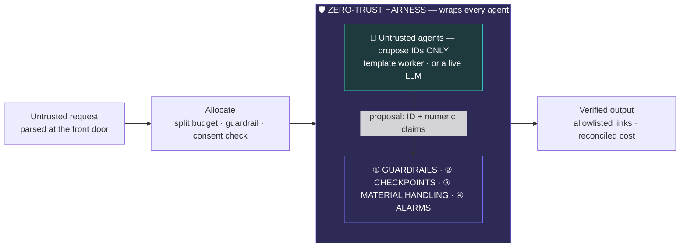

# GitTrippin

[](https://github.com/Freya-22/GitTrippin/actions/workflows/tests.yml)


**A deterministic zero-trust harness that governs untrusted LLM agents.**

Agentic systems are dangerous precisely because they take action — they link, they
spend, they commit. You cannot fix that by asking a model to be careful, because
the failure you are defending against is the model being confidently wrong or
actively steered. So this system moves every piece of authority — input
validation, URL minting, state persistence, spend control, telemetry — **out of
the model and into deterministic code that surrounds it**. An agent's only
permitted output is an opaque ID plus numeric claims. The harness independently
re-derives every one of those claims against data the agent does not control,
builds the links itself, decides what persists, and raises a structured alarm on
every violation. The agent's word is evidence. It is never the decision.

The property that falls out of this is the one worth testing: **a fully
compromised agent** — adversarially tuned, prompt-injected, or swapped for an
attacker's implementation — can still only cause the harness to select a
*different valid record from ground truth*, or to fail a checkpoint and escalate
to a human. It cannot fabricate a record, misstate one, emit a link, widen its
own data access, exceed the spend ceiling, or suppress an alarm. Each of those is
a row in the table below, and each row has a test.

> **Read next:** [SECURITY_MODEL.md](SECURITY_MODEL.md) — trust boundary, TCB
> contents, explicit assumptions, residual risks, and what would have to change
> to run this against a live model and real payment rails.

---

## Threat model

Nine of these rows come from the original design document; T03–T05 split what was
one row into the three distinct failure modes the auditor actually distinguishes,
and T12 covers a control that existed in code before it had a row.

| # | Threat | Vector | Control | Implemented at | Proven by |
|---|---|---|---|---|---|
| T01 | Prompt injection via user-supplied fields | Adversarial string in a request field, hoping to reach an agent as an instruction | Structural sandboxing. Raw text never reaches an agent; input is parsed into a strict Pydantic `TripProfile` of closed enums and bounded types, so an injection string **is not a valid value** | [`guardrails.py:50`](harness/guardrails.py#L50) [`schemas.py:64`](harness/schemas.py#L64) | `test_input_guardrail_rejects_injection_shaped_diet`<br>`test_strict_models_forbid_unknown_fields` |
| T02 | Phishing / hallucinated link emission | Agent returns `http://evil.tld/login`, or smuggles a scheme or path traversal through an ID field | Agents emit opaque IDs only. `NoUrlModel` regex-rejects URL-shaped strings anywhere in agent output; `EntityId` is a tight character class; `LinkBuilder` is the **only** component permitted to mint a URL, from a validated ID against a domain allowlist | [`schemas.py:126`](harness/schemas.py#L126) [`guardrails.py:216`](harness/guardrails.py#L216) | `test_output_guardrail_rejects_phishing_url`<br>`test_entity_id_rejects_smuggled_payload`<br>`test_link_builder_refuses_ids_that_escape_the_path` |
| T03 | Hallucinated entity | Agent proposes an ID that does not exist | Shadow Auditor re-looks-up every proposed ID in the inventory the agent does not control | [`guardrails.py:99`](harness/guardrails.py#L99) | `test_shadow_auditor_rejects_hallucinated_id` |
| T04 | Inflated or mismatched claims | Agent reports a real ID but misstates it — claims 4.6★ on a 2.5★ record | Shadow Auditor compares each `claimed_*` field against ground truth; price within 1%, rating within 0.05 | [`guardrails.py:145`](harness/guardrails.py#L145) | `test_shadow_auditor_rejects_inflated_claim` |
| T05 | Quality-threshold violation | Agent proposes a real, accurately-described record that still breaches a declared policy floor | Shadow Auditor enforces the rating floor and allocated-budget ceiling **independently of what the agent claims** | [`guardrails.py:135`](harness/guardrails.py#L135) | `test_shadow_auditor_rejects_low_rating`<br>`test_quality_fallback_blocks_bad_booking` |
| T06 | Safety-constraint violation | Agent proposes an option violating a declared hard constraint | Dietary gate — a record failing a declared restriction is rejected outright. No tolerance, no override path | [`guardrails.py:171`](harness/guardrails.py#L171) | `test_food_auditor_blocks_dietary_violation` |
| T07 | Cross-agent data leakage | Sensitive preference data reaches an agent with no legitimate need for it | A declared `SCOPE` table **is** the policy. `route()` projects the profile down to one agent's typed input; `assert_scoped()` is a hard runtime invariant that money-handling agents never carry preference fields | [`material_handler.py:40`](harness/material_handler.py#L40) [`:128`](harness/material_handler.py#L128) | `test_money_agents_never_receive_experience_fields`<br>`test_scope_policy_and_typed_schemas_cannot_drift`<br>`test_assert_scoped_rejects_a_mismatched_payload` |
| T08 | Runaway resource consumption | Fallback/retry loop burns tokens and spend without bound | Economic Governor enforces a hard per-session token and USD ceiling, checked **before** every agent invocation. Counters live in persisted state, so a replay cannot reset them | [`guardrails.py:254`](harness/guardrails.py#L254) | `test_economic_governor_halts_at_token_ceiling`<br>`test_economic_governor_halts_at_usd_ceiling`<br>`test_economic_governor_permits_spend_up_to_the_ceiling` |
| T09 | Unrealistic resource division | One stated preference consumes the whole budget, starving every other category | Budget Guardrail clamps the split to declared per-category caps and floors; clamping emits telemetry | [`budget.py:52`](harness/budget.py#L52) | `test_budget_guardrail_caps_dominant_category`<br>`test_allocation_never_exceeds_total` |
| T10 | Acting beyond authority without consent | Stated preferences cost more than the stated budget and the run proceeds anyway | Pre-booking overage interrupt — the run pauses on a real LangGraph `interrupt()` and asks accept-overage or apply-cuts **before** any booking | [`graph.py:100`](harness/orchestrator/graph.py#L100) | `test_overage_pauses_for_accept_or_cut`<br>`test_overage_resume_cut_fits_budget` |
| T11 | Silent failure / fabricated result | Agent invents a plausible answer rather than admitting it cannot satisfy the request | Explicit pass/fail checkpoint after every node. State persists **only on PASS**; a failure replays from the last good checkpoint with the machine-readable rejection reason as feedback. Three strikes escalates to a human — never a fabricated result | [`checkpoints.py:38`](harness/checkpoints.py#L38) [`node_wrapper.py:139`](harness/node_wrapper.py#L139) | `test_quality_fallback_blocks_bad_booking`<br>`test_three_strike_escalates_to_human_interrupt` |
| T12 | Telemetry integrity | A broken or hostile alarm sink crashes the run, or suppresses the record of a tripped control | `AlarmBus` fans out to each sink under its own exception guard and keeps a durable in-process record; a failing sink is itself reported and cannot affect control flow | [`alarms.py:127`](harness/alarms.py#L127) | `test_alarm_bus_survives_a_broken_sink`<br>`test_alarm_record_carries_the_full_schema` |

Full generated coverage, including every test per row: [docs/THREAT_COVERAGE.md](docs/THREAT_COVERAGE.md).

---

## Framework mapping

Conservative by intent — only mappings the code genuinely earns are listed, and
the omissions are stated below the table rather than left ambiguous.

| Control | OWASP Top 10 for LLM Apps (2025) | MITRE ATLAS | NIST AI RMF |
|---|---|---|---|
| Input guardrail — structural sandboxing, closed enums, `extra="forbid"` | **LLM01** Prompt Injection | [AML.T0051.000](https://atlas.mitre.org/techniques/AML.T0051) Direct Prompt Injection | MEASURE 2.7 |
| `NoUrlModel` + `EntityId` + `LinkBuilder` allowlist | **LLM05** Improper Output Handling | [AML.T0048.003](https://atlas.mitre.org/techniques/AML.T0048) External Harms: User Harm | MEASURE 2.7 |
| Shadow Auditor — independent re-derivation of every claim | **LLM09** Misinformation | [AML.T0062](https://atlas.mitre.org/techniques/AML.T0062) Discover LLM Hallucinations · [AML.T0060](https://atlas.mitre.org/techniques/AML.T0060) Publish Hallucinated Entities † | MEASURE 2.6 |
| Material Handling — declared `SCOPE`, least-authority routing | **LLM02** Sensitive Information Disclosure | [AML.T0057](https://atlas.mitre.org/techniques/AML.T0057) LLM Data Leakage | MANAGE 1.3 |
| Economic Governor — hard token / USD ceiling | **LLM10** Unbounded Consumption | [AML.T0034](https://atlas.mitre.org/techniques/AML.T0034) Cost Harvesting | MANAGE 2.4 |
| Checkpoints, replay-with-feedback, 3-strike human escalation | **LLM06** Excessive Agency | [AML.T0053](https://atlas.mitre.org/techniques/AML.T0053) AI Agent Tool Invocation | MEASURE 2.6 · MANAGE 2.4 |
| Pre-booking overage interrupt (human authorisation gate) | **LLM06** Excessive Agency | [AML.T0048.000](https://atlas.mitre.org/techniques/AML.T0048) External Harms: Financial Harm | MANAGE 4.1 |
| Budget Guardrail — per-category caps and floors | **LLM10** Unbounded Consumption | [AML.T0048.000](https://atlas.mitre.org/techniques/AML.T0048) External Harms: Financial Harm | MANAGE 1.3 |
| Structured JSONL alarms → stderr / file / Splunk HEC | — | — | MEASURE 3.1 · MANAGE 4.1 |

† The auditor does not detect these adversary techniques; it removes the
exploitable surface they depend on. A hallucinated identifier is never actioned,
so there is nothing for an adversary to discover or squat on.

**NIST subcategories referenced** — MEASURE 2.6 (*demonstrated to be safe … can
fail safely*), MEASURE 2.7 (*security and resilience are evaluated and
documented*), MEASURE 3.1 (*track existing and emergent risks*), MANAGE 1.3
(*responses to high-priority risks developed and documented*), MANAGE 2.4
(*mechanisms to supersede, disengage, or deactivate systems behaving
inconsistently with intended use*), MANAGE 4.1 (*post-deployment monitoring,
appeal and override, incident response*). The threat model itself is the MAP 5.1
artifact.

**Deliberately not claimed:** LLM03 Supply Chain, LLM04 Data and Model Poisoning,
LLM07 System Prompt Leakage, LLM08 Vector and Embedding Weaknesses. There is no
plugin or third-party model supply chain in scope, no training or fine-tuning, no
system prompt that functions as a security boundary, and no vector store or
retrieval surface. Claiming these would be mapping aspiration rather than code.

---

## Architecture

The harness **encloses** the agent — it is not a validation step bolted on after it.



Every agent runs the same fixed gauntlet, so no agent gains authority by being
smarter ([`node_wrapper.py`](harness/node_wrapper.py)):

```
[Economic]   governor.check()          → CRITICAL halt if over ceiling
[Material]   route(profile, agent)     → scoped input, least authority
[Agent]      agent.run(scoped, feedback)  ← the only untrusted step
[Guardrail]  output_guardrail(...)     → re-validate from dict; reject URLs
[Guardrail]  ShadowAuditor.audit(...)  → re-derive every claim vs ground truth
[Checkpoint] evaluate(...)             → explicit pass/fail
     PASS → LinkBuilder mints allowlisted link; state persists
     FAIL → alarm; feedback; replay from last good checkpoint; 3 strikes → human
```

Deeper detail: [ARCHITECTURE.md](ARCHITECTURE.md) (five layers, LangGraph state
flow, sequence diagrams) and [docs/HARNESS.md](docs/HARNESS.md) (contract, agent-swap guide).

---

## The four pillars

**① Guardrails** — `input_guardrail()` parses raw input into a strict Pydantic
`TripProfile`; closed enums mean an injection string in a field is simply not a
valid value. `NoUrlModel` regex-rejects URL-shaped strings anywhere in agent
output, `StrictModel` sets `extra="forbid"`, and `EntityId` is a tight regex
class so no payload can be smuggled through an ID. **`ShadowAuditor`** is an
independent deterministic second grader that re-looks-up every proposed ID in
ground truth and compares claim against reality — catching hallucinated IDs,
inflated ratings, and price mismatches beyond a 1% tolerance, plus a hard
safety gate. **`EconomicGovernor`** enforces a hard 60,000-token and $5.00
per-session ceiling. **`LinkBuilder`** is the only component permitted to mint a
URL. → [`guardrails.py`](harness/guardrails.py) · [`schemas.py`](harness/schemas.py)

**② Checkpoints** — an explicit pass/fail gate after every agent node. State
persists **only on PASS**; a failure replays the node from the last good
checkpoint with the machine-readable rejection reason as feedback, so successful
upstream work is never recomputed. Three strikes escalates to a human via a real
LangGraph `interrupt()`. → [`checkpoints.py`](harness/checkpoints.py) · [`node_wrapper.py`](harness/node_wrapper.py)

**③ Material Handling** — a declared `SCOPE` table is the policy, mapping each
agent to the exact fields it may receive. `route()` projects the validated
profile down to one agent's typed input; `assert_scoped()` is a hard runtime
invariant proving that preference data never enters a money-handling agent's
payload. Changing an agent's authority means editing that table in the open, not
burying a field-pick inside agent code. → [`material_handler.py`](harness/material_handler.py)

**④ Alarms** — every tripped rule emits one structured JSONL record with `ts`,
`session_id`, `alarm_type`, `severity`, `context`, and `recommended_action`,
fanned out through an `AlarmBus` to stderr, a file, and a **Splunk HTTP Event
Collector** sink — with per-sink exception isolation, so a broken telemetry sink
can never crash a run. → [`alarms.py`](harness/alarms.py)

---

## Control evidence

The suite is not 38 assertions about a travel planner. Every test is tagged with
the pillar it exercises and the threat-model row it proves, so the output reads
as a control matrix. Fully offline and deterministic — seed inventory, no
network, no LLM.

```console
$ pytest -q --control-matrix
......................................                                   [100%]
=============================== CONTROL MATRIX ================================

Coverage by pillar
  guardrails    23 tests
  checkpoints    6 tests
  material       5 tests
  alarms         2 tests
  (untagged)     2 tests

Coverage by threat-model row
  [PASS] T01  Prompt injection via user-supplied fields  6 test(s)
  [PASS] T02  Phishing / hallucinated link emission      7 test(s)
  [PASS] T03  Hallucinated entity                        1 test(s)
  [PASS] T04  Inflated or mismatched claims              1 test(s)
  [PASS] T05  Quality-threshold violation                2 test(s)
  [PASS] T06  Safety-constraint violation                1 test(s)
  [PASS] T07  Cross-agent data leakage                   4 test(s)
  [PASS] T08  Runaway resource consumption               3 test(s)
  [PASS] T09  Unrealistic resource division              3 test(s)
  [PASS] T10  Acting beyond authority without consent    4 test(s)
  [PASS] T11  Silent failure / fabricated result         2 test(s)
  [PASS] T12  Telemetry integrity                        2 test(s)

  12/12 threat-model rows proven by at least one test.

38 passed in 0.89s
```

Two tests are deliberately **untagged**: they cover inventory-ranking behaviour,
which is application correctness rather than a harness control. Tagging them
would inflate the matrix.

Slice the suite by control:

```bash
pytest -m guardrails            # Pillar 1 only
pytest -m "material or alarms"  # isolation + telemetry
pytest -m e2e                   # full LangGraph pipeline
```

The threat-coverage table is **generated from the test markers**, not
hand-maintained — and CI fails if the committed table drifts from the suite:

```bash
pytest --collect-only -q --control-matrix-md docs/THREAT_COVERAGE.md
```

A test referencing a threat id that is not in the threat model is a hard
collection error, so the matrix cannot silently diverge from what is enforced.

---

## Quickstart

```bash
pip install -r requirements-dev.txt   # runtime + pytest
pytest -q --control-matrix            # 38 control tests, offline, ~1.5s
```

```bash
# CLI — exit 0 success · 2 escalated · 3 paused awaiting a human
python main.py run --trip trip.json --user demo --id demo001    # → runs/demo001/itinerary.html
python main.py run --trip trip_luxury.json --id lux001          # → PAUSES: over budget, needs consent (exit 3)
python main.py resume --id lux001 --decision cut                # → apply cost-cuts and re-plan
python main.py run --trip trip_hardfail.json --id hitl001       # → PAUSES: 3-strike human escalation (exit 3)
python main.py replay --id demo001 --from hotel                 # → replay from last good checkpoint
python main.py run --trip trip.json 2> alarms.jsonl             # → pipe the alarm stream to a SIEM
```

```bash
# Web UI — same harness, live run timeline and alarm feed
pip install -r requirements-web.txt && streamlit run app.py
```

```bash
# Containerised, non-root, zero ambient trust — the demo needs no egress at all
docker build -t gittrippin . && docker run --rm --network none gittrippin run --trip trip.json
```

Set `SPLUNK_HEC_URL` and `SPLUNK_HEC_TOKEN` to push alarms straight to a Splunk
HTTP Event Collector.

**Stack:** Python · LangGraph (state machine, SQLite checkpointing, replay,
`interrupt()`) · Pydantic (schemas, structural sandboxing) · Docker · Splunk HEC.

---

## What this is not

Stated plainly so their absence is not mistaken for an oversight. The full
version, with assumptions and residual risks, is in
[SECURITY_MODEL.md](SECURITY_MODEL.md).

- **Not a model-safety system.** No attempt is made to make the model behave. The
  design premise is that it will not.
- **Not a content filter.** No classifier, no keyword blocklist, no heuristic
  detection anywhere. Every control is a type constraint, a lookup, or a
  comparison — deliberately, because heuristics have false-negative rates and
  `extra="forbid"` does not.
- **Not a sandbox.** Agents are untrusted but run **in-process**. The trust
  boundary is a data boundary, not a memory boundary; a hostile agent *module*
  (as distinct from a hostile model behind a well-behaved module) is out of
  scope. Per-agent process isolation is the fix.
- **Not authenticated.** No authn, no authz, single-tenant. `session_id` is a
  correlation label, not a security principal. The Economic Governor bounds spend
  within one session; nothing bounds the number of sessions.
- **Not real economics.** Token and dollar accounting is synthetic in the demo
  (a fixed charge per attempt). The ceiling logic is real and tested; the meter
  feeding it is fabricated until wired to a live provider's usage.
- **Not running a live LLM by default.** Agents are deterministic template
  workers so the suite is reproducible. One Claude-backed agent swaps in behind
  the same `Protocol` and earns no additional trust.
- **Not a production booking system.** Nothing here touches real money.

---

## Travel is just the demo

The demonstration surface is a five-agent travel planner — flight, hotel, car,
experience, food — because it is legible in thirty seconds and it exercises every
control naturally: it handles money, it emits links, it carries sensitive
preference data, and it has a ground truth to grade against.

None of that is the point. The agents are untrusted, swappable workers behind a
single Python `Protocol`; the harness is the artifact. Swap any agent — template
to Claude, seed inventory to a live API — and **not one line of the harness
changes**, because the new agent is granted no additional trust.

The two controls that generalise furthest are worth naming directly. The
**Shadow Auditor** encodes *a model's assertion about a record is never accepted
as the record* — the harness re-derives it from a source the model cannot
influence. **Material Handling** encodes *authority is a declared table, checked
at runtime* — data provably never reaches a component outside its scope. Neither
has anything to do with travel.
